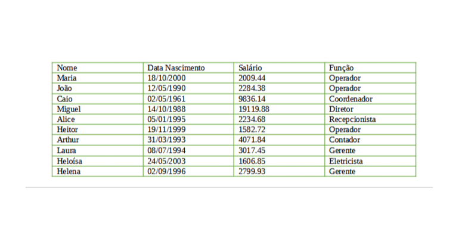

# Teste Prático - Gestão de Funcionários (Java)

Este repositório contém a solução do teste prático de programação em Java, cujo objetivo é simular o gerenciamento e manipulação de dados de funcionários de uma indústria utilizando Orientação a Objetos, a API do Java 8+ (Streams, Lambdas, java.time) e manipulação de coleções.

## Requisitos Implementados

1 & 2. Modelagem de Dados:

- Classe base Pessoa com os atributos nome (String) e dataNascimento (LocalDate).

- Classe Funcionario estendendo Pessoa, com os atributos adicionais salario (BigDecimal) e funcao (String).

    3.1. Inserção de Dados: Cadastro inicial de todos os funcionários respeitando a tabela abaixo:

3.2. Remoção: Remoção do funcionário "João" da lista.

3.3. Formatação de Saída: Impressão dos dados formatando a data de nascimento (dd/MM/yyyy) e o salário no padrão monetário brasileiro (R$ X.XXX,XX).

3.4. Reajuste Salarial: Aplicação de aumento de 10% no salário de todos os funcionários.

3.5 & 3.6. Agrupamento em Map: Agrupamento dos funcionários por função utilizando Map<String, List<Funcionario>> e impressão organizada por categoria.

3.8. Aniversariantes: Filtragem e exibição dos funcionários que fazem aniversário nos meses 10 (Outubro) e 12 (Dezembro).

3.9. Funcionário de Maior Idade: Identificação do funcionário mais velho, exibindo seu nome e a idade exata calculada em anos.

3.10. Ordenação Alfabética: Exibição da lista de funcionários em ordem alfabética de nome.

3.11. Total de Salários: Cálculo da soma total dos salários de todos os funcionários.

3.12. Salários Mínimos: Cálculo e exibição de quantos salários mínimos (considerando o valor de referência R$ 1.212,00) cada funcionário recebe.

## Tabela de Referência Inicial

Nota: Para exibir a imagem no GitHub, coloque o arquivo da imagem na raiz do projeto com o nome tabela_funcionarios.png (ou ajuste o caminho caso salve dentro de uma pasta como docs/tabela_funcionarios.png).

## Tecnologias e Recursos Utilizados

Linguagem: Java 19+ (compatível com Java 8+)

API java.time: LocalDate, DateTimeFormatter, Period

Manipulação Financeira: BigDecimal, NumberFormat, RoundingMode

Streams & Lambdas: Agrupamento (Collectors.groupingBy), ordenação (Comparator), filtragem e cálculos agregados.

## Como Executar o Projeto

### Pré-requisitos:

Ter o JDK 11+ instalado.

VS Code, Eclipse, IntelliJ ou qualquer IDE de sua preferência.

#### Passos de Execução:

Clone este repositório:

`git clone https://github.com/Ldsantana2/Teste-Pratico-Iniflex`

Navegue até a pasta do projeto:

`cd SEU-REPOSITORIO`

Compile e execute a classe Principal, via bloco de código ou botão run dentro da IDE:

`javac -d bin src/\*.java`

`java -cp bin Principal`
